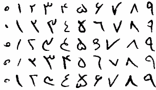
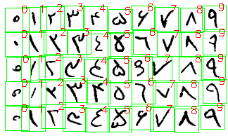

# OpenCV Image to Dataset Converter

Slice a single image of Persian digits into multiple pieces and create a dataset from them.

## Input



## Output



The result is a dataset of images of digits extracted from the input image:

[`data/dataset.npz`](data/dataset.npz)

You can load the dataset from the file using np.load method:

```python
data = np.load(DATASET_PATH)
datasetImages = data['images']
datasetLabels = data['labels']
```